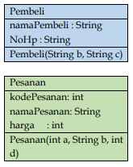
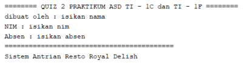
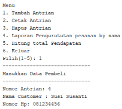
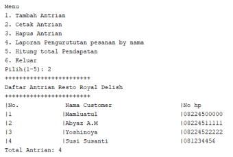
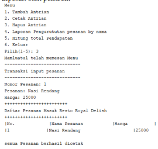

# LAPORAN QUIZ 2 PRAKTIKUM ALGORITMA DAN STRUKTUR DATA

Dibuat oleh : 

Yasmine Navisha Andhani 

1F D4 Teknik Informatika 

2141720047 

## Soal
Buatlah sebuah sistem informasi Antrian pembeli pada resto Royal Delish dengan menggunakan konsep double linked list. Pada sistem informasi tersebut wajib ada kelas Pembeli dan kelas Pesanan. 
 
 

Gambar diatas merupakan diagram class dari Pembeli dan Pesanan. Atribut dan method boleh ditambahi. Screenshoot eksekusi program harus menampilkan nama peserta kuis yang bersangkutan. Contoh saat program pertama kali running
 
 

1. Tambah Antrian 

Pada saat dipilihan menu tambah antrian maka sistem akan menambahkan nomor antrian sesuai dengan urutan antrian yang ada. Kemudian sistem akan meminta inputan berupa nama pembeli, 
dan nomor hp. Data yang sudah diinputkan akan disimpan di linked list. 

contoh : 

 

2. Cetak Antrian 

Menu ini akan menampilkan seluruh antrian yang ada pada linked list. 

Contoh : 

 

3. Hapus Antrian 

Hapus antrian harus sesuai dengan No antrian. Pada menu hapus antrian artinya pembeli telah menuju kasir untuk pesan makanan. Sehingga pada menu ini harus di inputkan makanan yang dipesan oleh pembeli. 

 

4. Laporan pesanan (urut by Nama)

Ketika semua atrian telah habis dan resto akan tutup Menu ini akan melaporkan daftar pesanan yang sudah masuk dan terurut berdasarkan nama pesanan 

5. Hitung total pendapatan 

Ketika semua atrian telah habis dan resto akan tutup maka menu total pendapatan digunakan untuk menghitung keseluruhan pendapatan dari pesanan yang sudah masuk 

